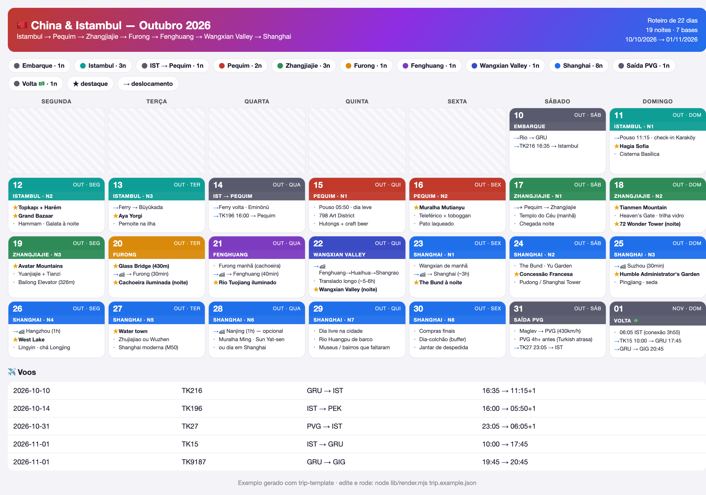

# 🧳 Bou Trip

Monte um roteiro de viagem respondendo perguntas e receba um **calendário visual em HTML**
(responsivo no celular, imprimível em PDF). Sem instalar nada — só Node.

Dois jeitos de usar: **no terminal** ou **conversando com o Claude**.



---

## 🚀 Começar

```bash
# 1. clone (ou use "Use this template" aqui no GitHub)
git clone https://github.com/abouhid2/Bou-Trip.git
cd Bou-Trip
```

### Opção A — Terminal (assistente interativo)
```bash
node generate.mjs
```
Ele pergunta destino, datas, paradas (noites + destaques) e voos opcionais, e gera:
- **`my-trip.html`** — seu roteiro visual (abra no navegador)
- **`trip.json`** — seus dados (edite e regenere quando quiser)
- **`my-trip.kml`** — todos os pontos para ver num mapa e usar offline (se houver coordenadas)

> Precisa do [Node.js](https://nodejs.org) 18+. Confira com `node --version`.

### Opção B — Claude (conversando)
Abra a pasta no **Claude Code** (ou cole o conteúdo no **claude.ai**) e diga:

> *"Monta meu roteiro de viagem"*

O Claude faz as perguntas, escreve o `trip.json` e gera o HTML pra você.
As instruções que ele segue estão em [`CLAUDE.md`](CLAUDE.md).

---

## ✏️ Editar depois

Seu roteiro vive no `trip.json`. Mude o que quiser e regenere:
```bash
node lib/render.mjs trip.json my-trip.html
```

Para detalhar um dia específico de uma parada de várias noites, use o campo `days`
(veja o exemplo). `★` marca destaque, `→` marca deslocamento.

---

## 🔗 Links e 🗺️ mapas offline

Cada item pode virar **clicável**: `url` (página do lugar), `tickets` (🎟️ comprar ingresso)
e `coords` (📍 abre o mapa). O HTML é **self-contained e funciona offline** para leitura;
os links só precisam de internet quando você toca neles.

- **📍 dos lugares:** abrem no **Google Maps** por padrão. Em viagens à **China continental**,
  defina `"maps": "osm"` no `trip.json` — lá o Google é bloqueado e desloca as coordenadas.
- **Ver todos os pontos num mapa + offline:** o gerador cria um **`my-trip.kml`**. Importe no
  **Organic Maps** (grátis, offline, qualquer país) ou no **Google My Maps**. Passo a passo em
  **[`OFFLINE-MAPS.md`](OFFLINE-MAPS.md)**.

---

## 🧩 Formato (`trip.json`)

```jsonc
{
  "title": "Minha Viagem", "emoji": "🧳",
  "travelers": "Alex & Bia",
  "startDate": "2026-10-10",          // 1º dia (AAAA-MM-DD) — as datas são calculadas daqui
  "maps": "google",                   // "google" (padrão) | "osm" (use na China continental)
  "stops": [
    {
      "city": "Tóquio", "nights": 4,
      "highlights": [
        "Shibuya",
        { "type": "star", "text": "Monte Fuji",
          "url": "https://...", "tickets": "https://...", "coords": [35.3606, 138.7274] }
      ],
      "days": [                        // opcional: conteúdo dia a dia (tem prioridade)
        [ { "type": "move", "text": "Chegada Narita" }, "Check-in" ],
        [ { "type": "star", "text": "Senso-ji" }, "Asakusa" ]
      ]
    },
    { "city": "Voo Tóquio→Kyoto", "nights": 1, "transit": true,
      "highlights": [{ "type": "move", "text": "Shinkansen 2h15" }] }
  ],
  "flights": [
    { "date": "2026-10-10", "flightNo": "JL8", "from": "GRU", "to": "NRT", "dep": "16:00", "arr": "22:00+1" }
  ]
}
```

Veja **[`trip.example.json`](trip.example.json)** para um exemplo completo (a viagem da China).

---

## 📁 Estrutura

| Caminho | O que é |
|---------|---------|
| `generate.mjs` | Assistente de terminal (perguntas → `trip.json` + `my-trip.html` + `my-trip.kml`) |
| `lib/render.mjs` | Motor: transforma `trip.json` em HTML e KML (também roda via CLI) |
| `trip.example.json` | Exemplo de entrada (viagem China & Istambul 2026) |
| `CLAUDE.md` | Instruções para o modo Claude |
| `OFFLINE-MAPS.md` | Como ver os pontos num mapa e usar offline (Organic Maps / Google) |
| `examples/china-2026/` | Exemplo bem detalhado: logística, dia a dia, dicas, mapa KML, PDF |

---

Feito para a galera planejar a própria aventura. Boa viagem! ✈️
